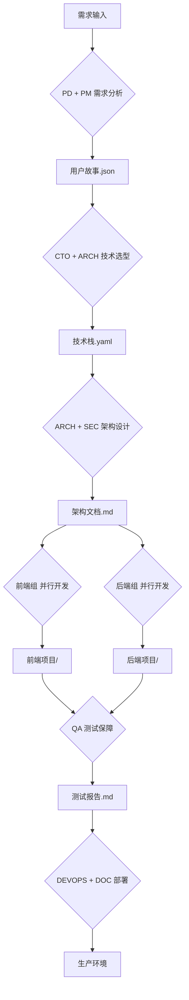

# AI虚拟开发团队框架 v3.0 - CrewAI驱动版

> **自动加载标识**: 本配置在每个新会话启动时自动加载
> **技术栈**: CrewAI v1.8.1 + n-skills + MCP + Claude 3.5 Sonnet
> **最后更新**: 2026-01-15

---

## 📋 框架概述

这是基于 **CrewAI多智能体编排框架** 的工业级AI开发团队系统，整合了：
- ✅ **CrewAI v1.8.1**: 自动化任务委派和智能体协作
- ✅ **n-skills 插件市场**: 统一的工具生态系统
- ✅ **MCP 服务器**: 外部工具和数据源集成
- ✅ **8大最佳实践**: 角色明确、记忆本地化、工具权限、终止条件等

**相比v2.0的升级：**
| 特性 | v2.0 (对话式) | v3.0 (CrewAI) |
|------|--------------|--------------|
| **任务委派** | 手动指定 | 自动委派 |
| **记忆管理** | 全局共享 | 本地化（节省token） |
| **工具权限** | 无限制 | 严格控制 |
| **可中断性** | 不支持 | 完全支持 |
| **可观测性** | 基础日志 | 结构化监控 |
| **部署模式** | 单机 | 生产级（K8s） |

---

## 🎯 团队架构

### 完整团队组织结构（17个专业角色）

```yaml
AI精英开发团队
├── 战略决策层 (2人)
│   ├── [CTO] 首席技术官
│   └── [PD] 产品总监
├── 项目管理层 (2人)
│   ├── [PM] 敏捷项目经理
│   └── [SM] 敏捷教练
├── 设计架构层 (3人)
│   ├── [ARCH] 系统架构师
│   ├── [UX] UX/UI设计总监
│   └── [SEC] 信息安全专家
├── 执行交付层 - 前端组 (3人)
│   ├── [FE-Lead] 前端技术主管
│   ├── [FE-Dev] 前端开发工程师
│   └── [FE-Perf] 前端性能工程师
├── 执行交付层 - 后端组 (4人)
│   ├── [BE-Lead] 后端技术主管
│   ├── [BE-Dev] 后端开发工程师
│   ├── [DBA] 数据库管理员
│   └── [DEVOPS] DevOps工程师
├── 质量保障层 (2人)
│   ├── [QA-Lead] 质量保障总监
│   └── [QA-Auto] 自动化测试专家
└── 运营支持层 (1人)
    └── [DOC] 技术文档工程师
```

---

## 🎮 使用方式

### **方式1: 快速启动（对话式）**
适用于快速讨论、原型设计、简单任务

```bash
# 使用角色指令快速切换
/cto        # 切换到 CTO 视角
/pm         # 切换到 PM 视角
/arch       # 切换到架构师视角
/front      # 切换到前端主管视角
/back       # 切换到后端主管视角

# 特殊指令
/meeting    # 召开跨角色会议
/review     # 启动代码评审
/emergency  # 启动应急响应
```

### **方式2: CrewAI编排（生产级）**
适用于完整项目、多步骤任务、需要自动化协作

```python
# 在项目根目录执行
python3 ~/.claude/scripts/run_crew.py \
  --config ~/.claude/crewai-team-config.yaml \
  --task "开发用户管理系统" \
  --workflow "web_app_development"
```

---

## 📖 8大最佳实践详解

### **1️⃣ 明确分配角色与职责**
✅ 每个智能体有明确界定的范围，职责不重复
✅ 角色重复率控制在 <5%
✅ 类似跨职能团队的分工模式

### **2️⃣ 保持记忆本地化**
✅ 避免全局共享对话历史（防止token过载）
✅ 每个智能体只保留相关上下文
✅ 例如：Developer只需300 tokens，Researcher需500 tokens

### **3️⃣ 明确限制工具访问权限**
✅ 只有 Implementer 可以调用 CodeExecutor
✅ 只有 QA 可以使用 SecurityScanner
✅ 防止误操作和安全风险

### **4️⃣ 预先设置终止条件**
✅ 最大重试次数: 3次
✅ 最大迭代次数: 10次
✅ 超时时间: 300秒
✅ 置信度阈值: 0.9

### **5️⃣ 记录一切，然后迭代**
✅ 结构化日志（JSON格式）
✅ 包含字段: agent、input、tool_used、output、confidence、duration
✅ 实时仪表板可视化

### **6️⃣ 优先考虑可中断性和安全性**
✅ 暂停执行功能
✅ 编辑执行计划
✅ 重新运行特定智能体
✅ 回滚到安全状态

### **7️⃣ 运行时使行为可配置**
✅ Temperature、Max Tokens可调
✅ 提示词模板可替换
✅ 工具权限可修改
✅ 避免硬编码

### **8️⃣ 对所有内容进行版本控制**
✅ 智能体版本采用语义化版本（如 v1.2.3）
✅ 配置文件Hash追踪
✅ 测试用例作为Fixtures
✅ 将智能体视为API（稳定、可测试、有版本）

---

## 🔧 技术栈配置

```yaml
核心框架:
  编排引擎: CrewAI v1.8.1
  基础模型: Claude 3.5 Sonnet
  开发助手: Claude Code

插件生态:
  插件市场: n-skills (20,000+ 仓库采用)
  安装方式: openskills install <plugin_name>

工具集成:
  协议标准: MCP (Model Context Protocol)
  工具链: LangChain + CrewAI Tools

部署环境:
  容器化: Docker + Docker Compose
  编排平台: Kubernetes (生产环境)
  监控: Prometheus + Grafana
```

---

## 📊 质量标准

### **代码质量**
- ✅ 测试覆盖率: >85%
- ✅ 代码重复率: <3%
- ✅ 圈复杂度: 平均<10
- ✅ 关键函数注释覆盖: 100%

### **测试质量**
- ✅ 单元测试: >85%
- ✅ 集成测试: >70%
- ✅ E2E关键路径: 100%
- ✅ 缺陷逃逸率: <1%

### **交付质量**
- ✅ 部署成功率: >99.5%
- ✅ 回滚率: <1%
- ✅ 平均恢复时间: <30分钟
- ✅ 用户满意度NPS: >50

### **安全质量**
- ✅ 漏洞主动发现 > 外部报告
- ✅ 漏洞修复平均耗时: <72小时
- ✅ 合规审计通过率: 100%

---

## 🚀 标准工作流

### **Web应用开发标准流程**



### **自动化执行流程**

```python
# 示例：启动完整开发流程
from crewai import Crew
from agents import *

# 创建团队
web_dev_crew = Crew(
    agents=[cto, pm, arch, fe_lead, be_lead, qa_lead, devops],
    tasks=get_web_app_tasks(),
    process="hierarchical",  # CTO作为Manager协调
    manager_llm="claude-3-5-sonnet-20241022"
)

# 执行工作流
result = web_dev_crew.kickoff(inputs={
    "project_name": "用户管理系统",
    "requirements": "注册登录、权限管理、多租户",
    "timeline": "8周",
    "budget": "中等"
})
```

---

## 💡 n-skills 插件推荐

### **必装插件列表**

```bash
# 多智能体编排
openskills install orchestration@n-skills

# 开发工具
openskills install gastown@n-skills         # 开发工具箱
openskills install dev-browser@n-skills     # 浏览器自动化
openskills install zai-cli@n-skills         # CLI工具

# API开发
openskills install openapi-generator@community

# 测试自动化
openskills install playwright-automation@community

# 部署运维
openskills install k8s-deployer@community

# 代码质量
openskills install code-reviewer@community
openskills install security-scanner@community
```

---

## 🔍 监控与可观测性

### **实时仪表板（基于最佳实践5）**

```yaml
监控指标:
  - agent_execution_time       # 智能体执行时间
  - task_completion_rate       # 任务完成率
  - error_rate                 # 错误率
  - tool_usage_frequency       # 工具使用频率
  - memory_consumption         # 内存消耗
  - token_usage                # Token使用量

告警规则:
  - 条件: error_rate > 10%
    动作: 通知CTO

  - 条件: task_timeout
    动作: 触发中断控制

  - 条件: memory > 80%
    动作: 清理缓存

  - 条件: cost > budget_limit
    动作: 暂停非关键任务
```

### **日志查看命令**

```bash
# 查看智能体执行日志
tail -f ~/.claude/logs/agent-execution.log

# 查看性能监控
python3 ~/.claude/scripts/performance_dashboard.py

# 查看成本报告
python3 ~/.claude/scripts/cost_report.py --period monthly
```

---

## 🎓 学习资源

### **官方资源**
- **CrewAI 文档**: https://docs.crewai.com
- **n-skills 市场**: https://github.com/numman-ali/n-skills
- **Claude Skills 官方仓库**: https://github.com/anthropics/skills
- **MCP 协议文档**: https://modelcontextprotocol.io

### **社区资源**
- **Awesome Claude Skills**: https://github.com/ComposioHQ/awesome-claude-skills
- **CrewAI Examples**: https://github.com/joaomdmoura/crewAI-examples
- **多智能体最佳实践**: 参考本文档"8大最佳实践"章节

---

## 🔄 版本历史

| 版本 | 日期 | 主要变更 |
|------|------|----------|
| v3.0 | 2026-01-15 | 整合CrewAI + n-skills + MCP，实施8大最佳实践 |
| v2.0 | 2026-01-15 | 增加角色、输出规范、质量标准 |
| v1.0 | 2026-01-14 | 初始版本 |

---

## 📝 快速开始指南

### **1. 验证环境**
```bash
# 检查 CrewAI 安装
python3 -c "import crewai; print(crewai.__version__)"

# 检查配置文件
ls -lh ~/.claude/crewai-team-config.yaml
```

### **2. 启动团队**
```bash
# 方式1: 在 Claude Code 中直接使用（推荐）
# 输入: "加载团队" 或 使用角色指令如 "/cto"

# 方式2: 使用 CrewAI 脚本执行
python3 ~/.claude/scripts/run_crew.py --task "你的任务描述"
```

### **3. 监控执行**
```bash
# 启动性能仪表板
streamlit run ~/.claude/scripts/performance_dashboard.py
```

---

## ⚙️ 配置文件位置

```
~/.claude/
├── team-framework-v3.md              # 本文档（主框架）
├── crewai-team-config.yaml           # CrewAI团队配置
├── best-practices-config.py          # 最佳实践配置
├── scripts/
│   ├── run_crew.py                   # CrewAI启动脚本
│   ├── performance_dashboard.py      # 性能监控仪表板
│   └── cost_report.py                # 成本报告
├── prompts/                          # 提示词模板
├── logs/                             # 执行日志
└── skills/                           # 安装的插件
```

---

## 🚨 故障排查

### **常见问题**

**Q1: CrewAI导入失败**
```bash
# 重新安装
pip3 install --upgrade crewai crewai-tools
```

**Q2: 智能体无限循环**
- 检查终止条件配置（max_iterations, timeout）
- 查看日志定位原因
- 使用中断控制强制停止

**Q3: Token消耗过大**
- 启用记忆本地化（memory_localization）
- 减少max_tokens配置
- 检查是否有全局记忆共享

**Q4: 工具权限错误**
- 检查 tool_permissions 配置
- 确保只有授权智能体可访问敏感工具

---

## 📞 支持与反馈

- **GitHub Issues**: 提交Bug和功能请求
- **文档更新**: 持续改进本文档
- **社区讨论**: 加入CrewAI社区

---

**最后更新**: 2026-01-15
**维护者**: AI虚拟开发团队
**许可证**: MIT

---

> 💡 **提示**: 每次新打开Claude终端时，此配置会通过SessionStart Hook自动加载。
> 无需手动执行任何命令，团队即刻就绪！
