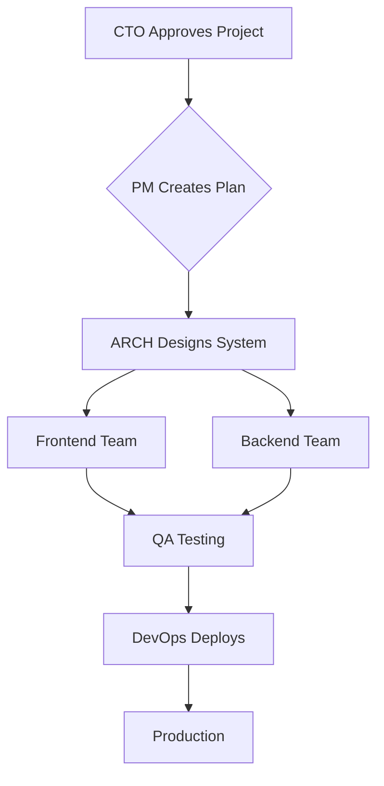

# Example: Web Application Development

This example demonstrates how to use the AI Multi-Agent Team to build a complete web application.

## Project Overview

**Project**: User Management System
**Timeline**: 8 weeks
**Tech Stack**: React + NestJS + PostgreSQL
**Team**: Full 17-agent team

## Usage

### Step 1: Initiate Project

```bash
# In Claude Code
Input: /meeting Start user management system project
```

### Step 2: Architecture Design

```bash
Input: /arch Design the system architecture

Expected Output:
- System architecture diagram
- Technology stack recommendations
- Database schema design
- API specifications
```

### Step 3: Frontend Development

```bash
Input: /front Build the user interface

Tasks:
- Component structure design
- State management setup
- UI/UX implementation
- Testing strategy
```

### Step 4: Backend Development

```bash
Input: /back Implement backend services

Tasks:
- API endpoints
- Database operations
- Business logic
- Authentication & authorization
```

### Step 5: Quality Assurance

```bash
Input: /qa Run comprehensive testing

Tasks:
- Unit tests
- Integration tests
- E2E tests
- Security audit
```

### Step 6: Deployment

```bash
Input: /devops Deploy to production

Tasks:
- CI/CD pipeline
- Container configuration
- Monitoring setup
- Deployment verification
```

## Expected Timeline

| Sprint | Duration | Focus | Deliverables |
|--------|----------|-------|--------------|
| 1 | Week 1-2 | Foundation | Authentication system |
| 2 | Week 3-4 | Core Features | RBAC permissions |
| 3 | Week 5-6 | Advanced Features | Multi-tenant + SSO |
| 4 | Week 7-8 | Polish | Optimization + Docs |

## Quality Metrics

- Code coverage: > 85%
- API response time (P95): < 200ms
- Security vulnerabilities: 0 high-severity
- Technical debt ratio: < 5%

## Team Collaboration Flow



## Files Generated

```
user-management-system/
├── frontend/
│   ├── src/
│   │   ├── components/
│   │   ├── pages/
│   │   ├── hooks/
│   │   └── services/
│   ├── package.json
│   └── README.md
├── backend/
│   ├── src/
│   │   ├── auth/
│   │   ├── user/
│   │   ├── permission/
│   │   └── tenant/
│   ├── package.json
│   └── README.md
├── docs/
│   ├── architecture.md
│   ├── api-spec.yaml
│   └── deployment.md
└── docker-compose.yml
```

## Tips

1. **Use /meeting for kickoff** - Gets all stakeholders aligned
2. **Break work into sprints** - Maintain focus and momentum
3. **Run /review regularly** - Catch issues early
4. **Document as you go** - Use /doc for documentation

## Troubleshooting

### Issue: Agent Not Responding

**Solution**: Check if the agent is in the correct state:
```bash
# Verify team status
Input: "Team status check"
```

### Issue: Code Quality Below Standards

**Solution**: Run comprehensive review:
```bash
Input: /review Full code quality audit
```

### Issue: Deployment Failures

**Solution**: Engage DevOps:
```bash
Input: /devops Debug deployment issue
```

## Next Steps

1. Review the generated code
2. Run tests locally
3. Deploy to staging
4. Gather user feedback
5. Iterate based on feedback

## Additional Resources

- [Full Documentation](../../docs/team-framework-v3.md)
- [Best Practices](../../docs/best-practices-summary.md)
- [API Reference](../../docs/api-reference.md)
