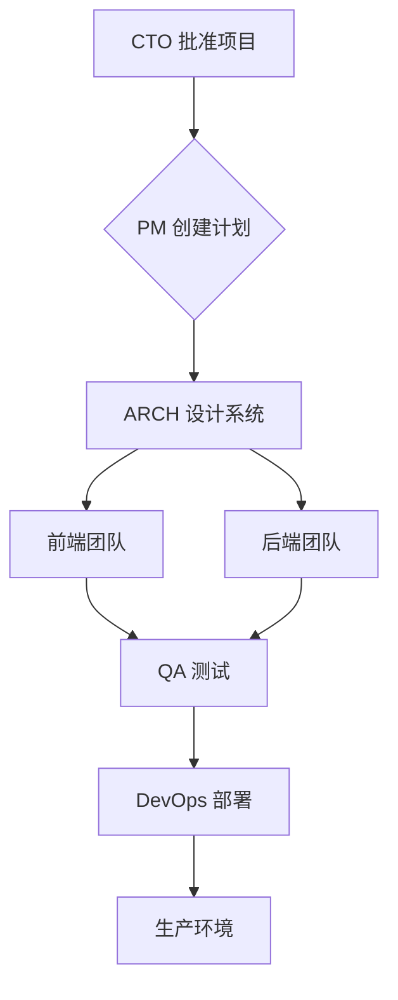

# 示例：Web 应用开发

本示例演示如何使用 AI 多智能体团队构建完整的 Web 应用程序。

**[English](README.md)** | **简体中文**

## 项目概览

**项目名称**：用户管理系统
**时间线**：8 周
**技术栈**：React + NestJS + PostgreSQL
**团队**：完整的 17 人智能体团队

## 使用方法

### 步骤 1：启动项目

```bash
# 在 Claude Code 中
输入：/meeting 启动用户管理系统项目
```

### 步骤 2：架构设计

```bash
输入：/arch 设计系统架构

预期输出：
- 系统架构图
- 技术栈推荐
- 数据库设计
- API 规范
```

### 步骤 3：前端开发

```bash
输入：/front 构建用户界面

任务：
- 组件结构设计
- 状态管理设置
- UI/UX 实现
- 测试策略
```

### 步骤 4：后端开发

```bash
输入：/back 实现后端服务

任务：
- API 端点
- 数据库操作
- 业务逻辑
- 认证和授权
```

### 步骤 5：质量保障

```bash
输入：/qa 运行全面测试

任务：
- 单元测试
- 集成测试
- 端到端测试
- 安全审计
```

### 步骤 6：部署

```bash
输入：/devops 部署到生产环境

任务：
- CI/CD 流水线
- 容器配置
- 监控设置
- 部署验证
```

## 预期时间线

| 冲刺 | 周期 | 重点 | 交付物 |
|--------|----------|-------|--------------|
| 1 | 第 1-2 周 | 基础 | 认证系统 |
| 2 | 第 3-4 周 | 核心功能 | RBAC 权限 |
| 3 | 第 5-6 周 | 高级功能 | 多租户 + SSO |
| 4 | 第 7-8 周 | 完善 | 优化 + 文档 |

## 质量指标

- 代码覆盖率：> 85%
- API 响应时间（P95）：< 200ms
- 安全漏洞：0 个高危
- 技术债务率：< 5%

## 团队协作流程



## 生成的文件

```
user-management-system/
├── frontend/
│   ├── src/
│   │   ├── components/
│   │   ├── pages/
│   │   ├── hooks/
│   │   └── services/
│   ├── package.json
│   └── README.md
├── backend/
│   ├── src/
│   │   ├── auth/
│   │   ├── user/
│   │   ├── permission/
│   │   └── tenant/
│   ├── package.json
│   └── README.md
├── docs/
│   ├── architecture.md
│   ├── api-spec.yaml
│   └── deployment.md
└── docker-compose.yml
```

## 技巧

1. **使用 /meeting 启动** - 让所有利益相关者保持一致
2. **将工作分解为冲刺** - 保持专注和动力
3. **定期运行 /review** - 及早发现问题
4. **边做边记录** - 使用 /doc 生成文档

## 故障排查

### 问题：智能体无响应

**解决方案**：检查智能体是否处于正确状态：
```bash
# 验证团队状态
输入："团队状态检查"
```

### 问题：代码质量低于标准

**解决方案**：运行全面审查：
```bash
输入：/review 进行完整的代码质量审计
```

### 问题：部署失败

**解决方案**：调用 DevOps：
```bash
输入：/devops 调试部署问题
```

## 后续步骤

1. 审查生成的代码
2. 在本地运行测试
3. 部署到预发布环境
4. 收集用户反馈
5. 基于反馈进行迭代

## 其他资源

- [完整文档](../../docs/team-framework-v3.md)
- [最佳实践](../../docs/best-practices-summary.md)
- [API 参考](../../docs/api-reference.md)
